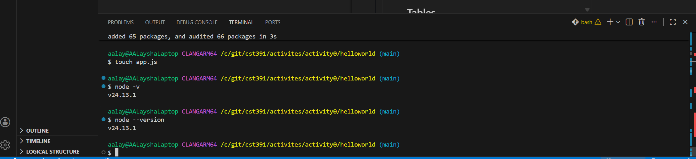
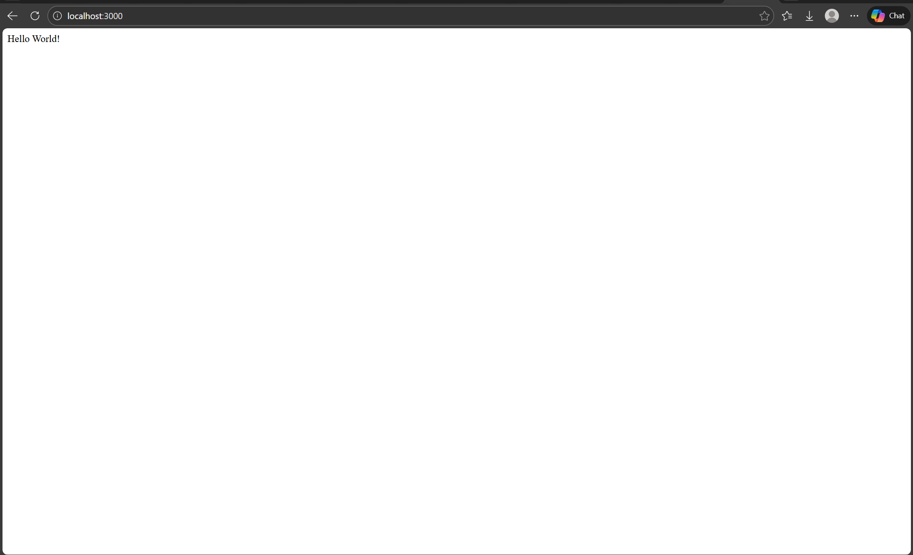
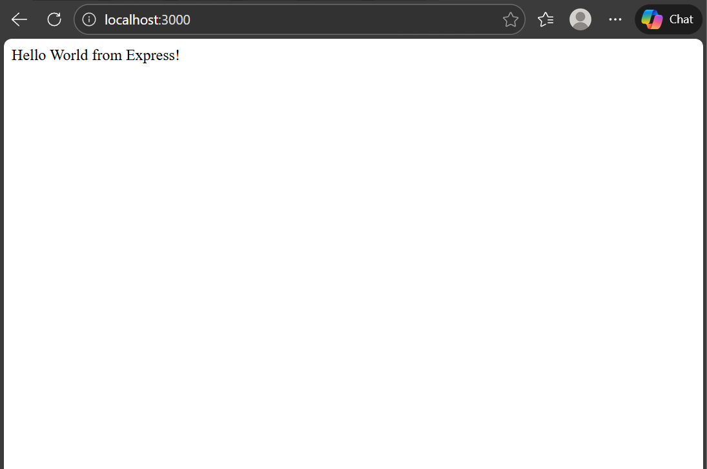
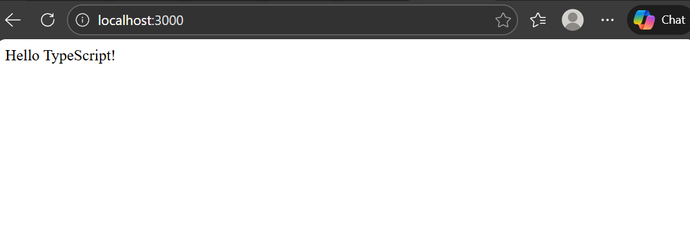

# Activity 0

- AA'Laysha Gibson 
- 02-17-2026

## introduction 

- This is activity 0 ...

For this activity, I started a simple web server using Node.js and Express.js. I created a new folder for the project and used npm to create a package.json file, which is used for tracking the project's dependencies. Next, I added Express to build a server to manage the requests and responses. Next, I created an app.js file and coded a route that sends a “Hello World” response back to the browser. I started the server in the terminal and opened a browser to test that the server delivered content to the client on localhost:3000. I also learned how to manage the dependencies of a project, run Node applications, and fix common issues like missing modules and where the terminal is located.


## Linux Installation
```java
sudo apt update
sudo apt upgrade -y
```

## Nodes and npm version
- This is a an image of the nodes and npm version ...



## NodeJS "Hello World" Application
``` java
/c/git/cst391/activites/activity0/helloworld
node app.js
```

-This is a image from Helloworld ...


## Express "Hello Express" Application


``` java
cd /c/git/cst391/activites/activity0xpress-helloworld
npm init -y
npm install express
touch app.js
node app.js
```

-This is a image from helloworld express ...




## NodeJS with TypeScript "Hello TypeScript" Application


``` java 
cd /c/git/cst391/activites/activity0
mkdir hellots
cd hellots
npm init -y
npm install typescript ts-node @types/node --save-dev
npm install express
npm install @types/express --save-dev
npx tsc --init
mkdir src
touch src/app.ts
npm run start
```

- This is an image of Hello type script ...


## Conclusion
I created simple ‘’Hello World’’ applications with plain Node.js and with the Express framework for the first time and as a first step, I created a Node.js development environment. I learned the basics of writing sever-side code applications in JS and TS, I learned to use TS with Node applications and to initialize a Node.js project with npm, including the installation of framework dependencies, and to run the application, for which I used a web browser to test, and I used the tool called Nodemon to automatically update the code while the development was ongoing. We also learn to manage the version control of the application using Git and I learned about the differences in module systems in Node applications which allowed us to learn the basics of server-side development.
