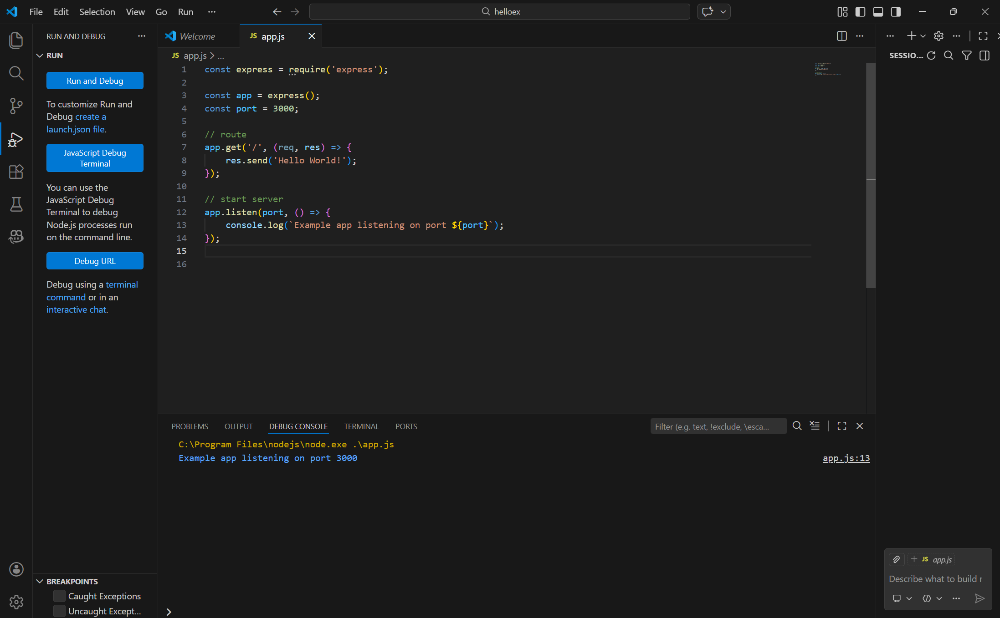
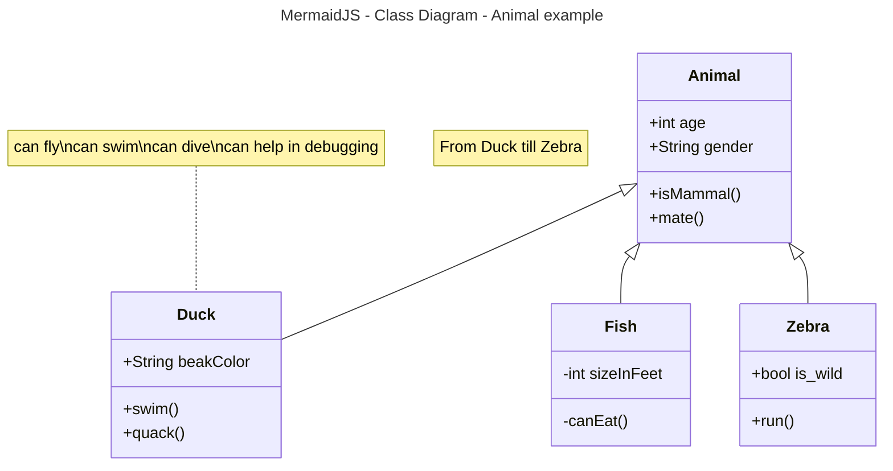

# Activity 0

- AA'Laysha Gibson 
- 02-17-2026

## introduction 

- This is activity 0 ...

this is part1 image...



this is part2 image ...


## Fruit list

1. pears
2. apples
     1. red 
     2. yellow
     3. green 
3. oranges

## Fruit list

- pears
- apples
     - red 
     - yellow
     - green 
- oranges

## Links / Images

- [wikiBob](https://gitlab.com/bobby.estey/wikibob/-/blob/master/README.md)
- [Grand Canyon University](https://www.gcu.edu/)


## Tables
|First Name|Last Name|
|--|--|
|AA'Laysha|Gibson|
|Ardrienne|Francis|

## Code Blocks

```java
// Java Example
public class CodeBlock {
    public static void main(String[] args) {
        System.out.println("Code Block Example");
    }
}
```


