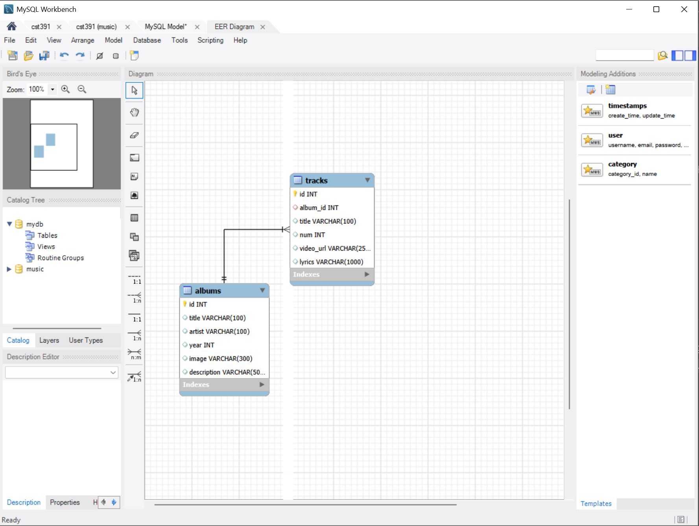

##Activity1 

 

AA'Laysha Gibson 

02-17-2026 

 

-This is Activity1 

  ## Introduction 

  MusicAPI is a lightweight RESTful web server using Node.js with TypeScript for added type safety and Express.js for routing and middleware.This application demonstrates professional backend practice by demonstrating endpoints that manage music resources (e.g. albums and artists) and includes: MVC architecture 

Environment variables Middleware REST routing 

MySQL database integration Live reload development This type of structure reflects what bigger frameworks create for you without thinking about it, and it gives you a better grasp of how production level Node applications work. 

 

 

  ## Executive summary 

 

 

  MusicAPI is a REST API that: 

 

- Runs on Node + Express 

 

- Uses TypeScript for maintainable code 

 

- Uses dotenv for environment configuration 

 

- Connects to a MySQL database 

 

- Uses MVC (Router → Controller → DAO → DB) 

 

- Supports live reload with nodemon 

 

### Key benefits: 

 

- Modular code structure 

 

- Easy debugging 

 

- Scalable design 

 

- Secure defaults (helmet + cors) 

 

  Database ready 

 

 

  ## Environmental Variables 

  ```env 

  PORT=5000 

   GREETING=Welcome to MusicAPI 

  ``` 

 

  ```ts 

  process.env.PORT 

   process.env.GREETING 

  ``` 

  - this allows me to Config without code changes, have Different dev/prod settings and Safer secrets handling 


  ## Database 

 

   

  ## Intaitialization 

 

    ```bash 

  git clone  

  cd MusicAPI 

  ``` 

 

```bash 

npm install 

npm install -g nodemon 

``` 

```ts 

package.json 

tsconfig.json 

.env 

``` 

 

```ts 

src/app.ts 

src/albums/ 

src/artists/ 

src/services/ 

src/middleware/ 

``` 

 

  ## Activity1 commmands 

 

```bash 

npm run start 

``` 

 

```bash 

npm install express dotenv cors helmet mysql 

npm install typescript ts-node nodemon --save-dev 

``` 

 

 

  ## Test Links 

 

 

  ```ts 

http://localhost:5000/ 

http://localhost:5000/albums 

http://localhost:5000/albums?albumId=7 

http://localhost:5000/artists 

``` 

  ## Conclusion 

 

  The MusicAPI project shows how to plan and create structured, professional backend applications using Node.js, Express.js, TypeScript, and MySQL. The application is built to show how to manually set up server scripts, environment variables, middleware, application routing, and the method to connect to a MySQL database. It helps to understand the basic building components of modern web server applications. Using the MVC design pattern helps to improves how it is organized, read, and scale, and the development and runtime of the application are improved through the use of nodemon, dotenv, and connection pooling. This project helps to gain important backend experience, which helps to work with large frameworks and production level applications of Node.js with confidence. 

 

 

  ## Troubleshooting 

|Issues|Solution|| 

|--|--|--| 

|npm run start fails or command not found|Run npm install to install dependencies|| 

|ts-node: command not found|Run npm install ts-node typescript --save-dev|| 

|Cannot GET / or routes not found|Confirm routers are registered in app.ts using app.use()|| 
