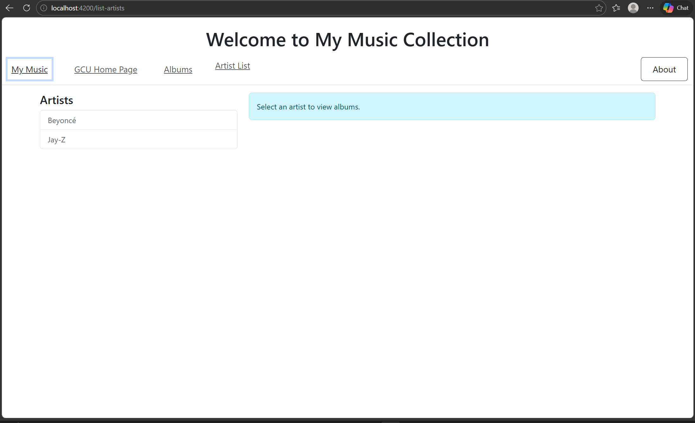

## Activity 3

AA'Laysha  Gibson

02-29-2026
  

## Introduction
In this activity, I built the front end of the Music Application using Angular. The goal was to create a user interface that uses multiple components, routing, and data binding to display artists and albums. Instead of connecting to a real database or API, mock JSON data was used to simulate how the application would work.I created components to list artists, show albums, and display album details, while also setting up navigation between pages. A music service was used to organize and manage the data. This activity helped me better understand Angular components, routing, services, and how data flows between different parts of an application.

## Links 
simple app
http://localhost:4200/

music app
http://localhost:4200/list-artists

## Music app Deliverables 

## Conclusion
In this activity, I successfully built the front end of my Music Application using Angular. I created multiple components, set up routing, used mock JSON data, and connected everything through a music service. The application now displays artists such as Beyoncé and Jay-Z and shows their albums correctly. This project helped me better understand how Angular components, services, and routing work together to build a functional and organized application.
 

 ## Troubleshooting

 |issues|Solutions|
|--|--|
|Incorrect File Paths and Import Errors|I fixed this by checking the correct file locations and updating the import statements to use the correct relative paths.|
|JSON File Errors|I fixed this by correcting the JSON file and ensuring it was properly formatted and not empty.|