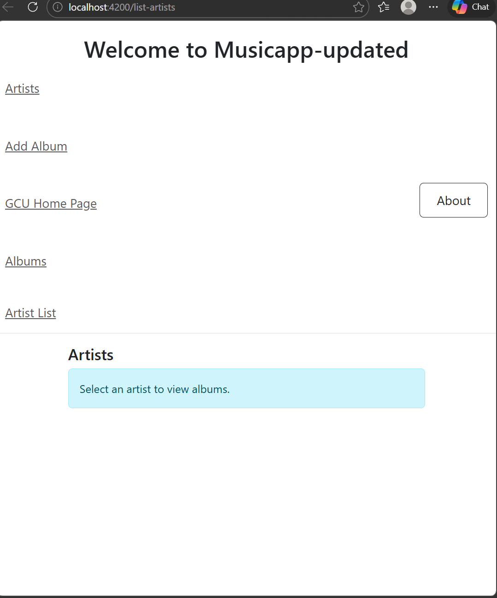
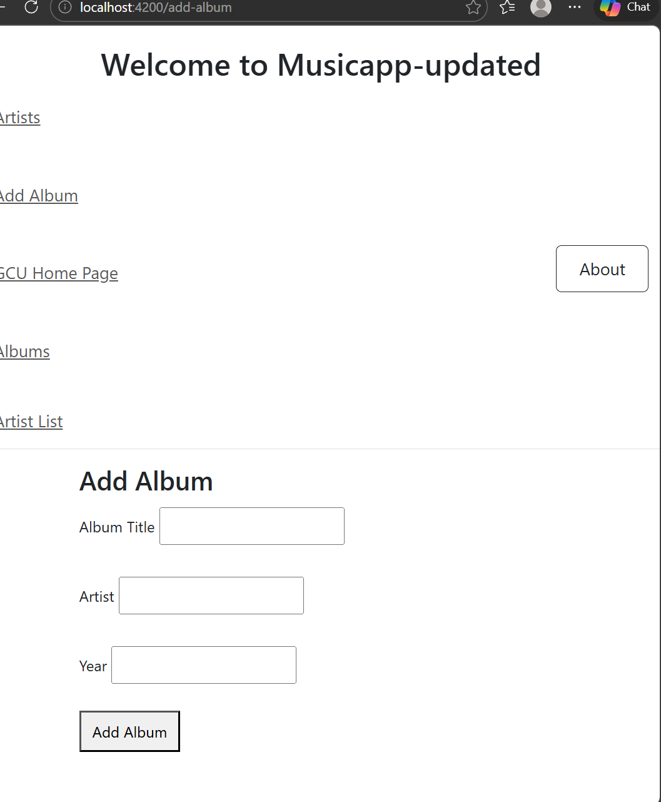
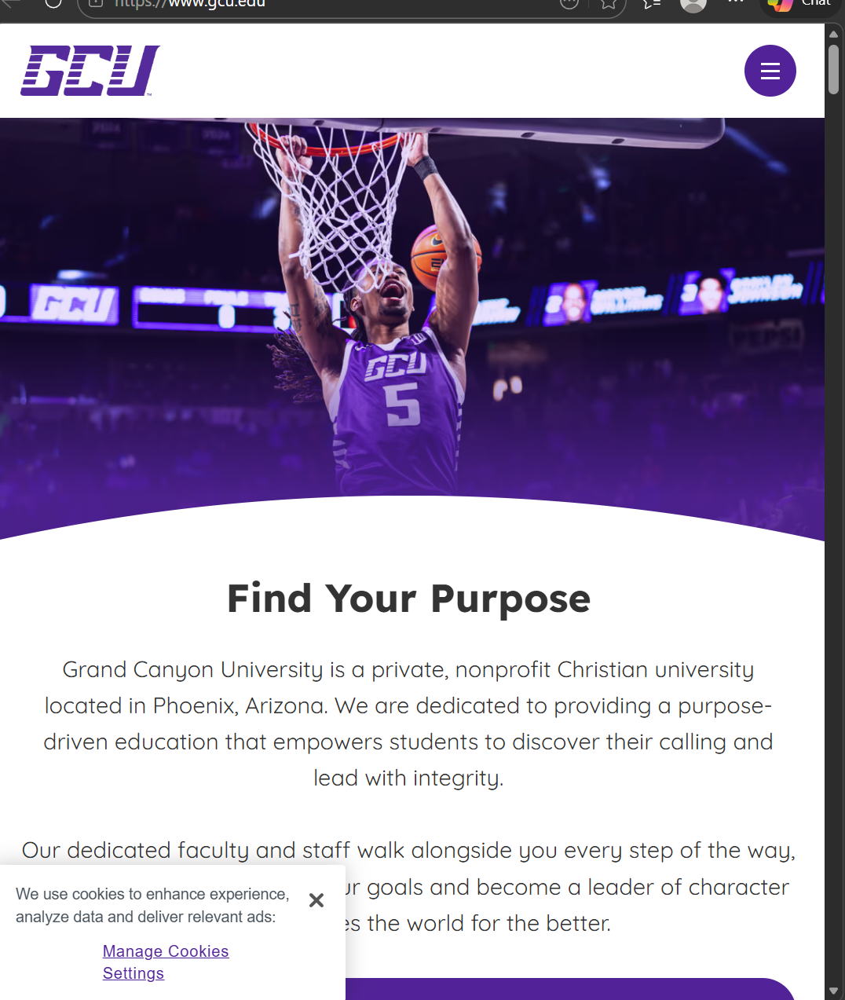

## Activity 4

Author: AA’Laysha Gibson

Date: March 2026
## Introduction

In Activity 4, I focused on establishing an Angular music app and launching it with the help of the Angular CLI and additional libraries; the aim for this activity was to learn how to install Angular app dependencies, set up an application environment, and run the application locally via the Angular development server. In this case, I was also required to install some additional libraries, such as Bootstrap, jQuery, and Popper, to enhance the user interface and functionalities of the music app. I also had the opportunity to run some terminal commands for package installation, Angular version verification, and application server launching. Once all environment configurations were set properly, I was finally able to locally run the Angular application and open it on the browser via the localhost development link. This activity further solidified my knowledge of Angular framework, especially the project structure, dependencies, and how to run the frontend application in the development environment.

## Activity 4 Commands
```bash
npm install
npm install -g @angular/cli 
npm install jquery --save-dev
npm install bootstrap
npm install @popperjs/core
ng version
ng serve
```
## sample-music-data.json (missing)

The sample-music-data.json file is crucial for this activity. It includes the sample music data the application requires to show artists, albums, or tracks. Without this file, the application may not function correctly or may display empty results. If the file is not found in the project folder, it needs to be downloaded from the given link and uploaded to the appropriate location in the application. Once the file is added, the student may need to restart the Angular server to allow the application to properly load the data.

## Test Links
http://localhost:4200/list-artists
http://localhost:4200/add-album
http://localhost:4200/list-artists
https://www.gcu.edu/
 
 ## Deliverables
 
 
Q

 ## Troubleshoot
 issues |solutions||
|--|--|--|
|Angular application produced warnings when running ng serve|The warnings did not prevent the application from running. I verified the application compiled successfully and continued testing.||
|Missing sample-music-data.json file|Downloaded the file from the provided source and placed it in the correct directory so the application could access the music data.||
|Running incorrect commands in Bash|Ensured only valid Angular and npm commands were used in the terminal.||
|Application could not reach backend API|Verified that the backend server was running and accessible before testing the Angular application.||
 ## conclusions
In Activity 4, I got practical understanding of what it takes to work with Angular and prepare a webapp dev environment. I worked on the assignment and used the Angular CLI and other dependencies, such as Bootstrap, jQuery, and Popper, to help me with the app’s functionality and design. Angular CLI commands came in handy for me to check the installation and run the dev server.

I was able to run the app using ng serve and access the app through http://localhost:4200, which gave me the check I needed for the proper configuration of the Angular project. This activity improved my understanding of Angular project setup and dependency management, as well as how to troubleshoot simple development problems. I am able to run Angular apps with confidence in the local development environment and this assignment has helped me get there.


[def]: screenahot1.png