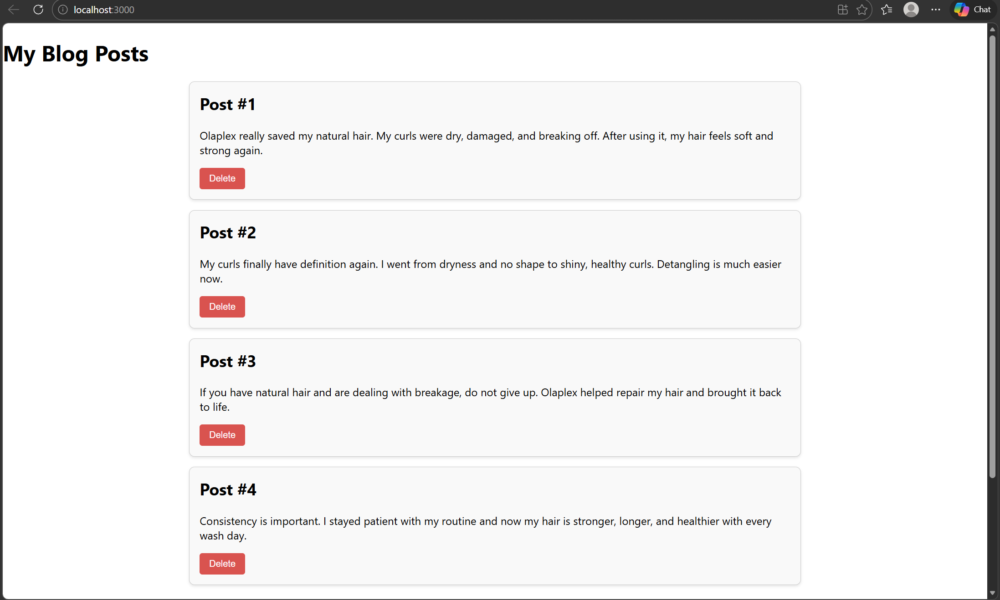

## Activity7
  

  AAlaysha Gibson
  03-29-2026

  ## Introduction 

This project demonstrates how to build a dynamic blog application using React. The goal was to understand how to create and manage components, use state, and pass data between components using props. In this application, users can view a list of blog posts, add new posts, and delete existing ones. This project helped reinforce important React concepts such as functional components, the useState hook, and event handling. It also shows how React updates the user interface automatically when the state changes, making the application interactive and responsive.
 
 ## Commands 
 ```bash
 npx create-react-app blog
cd blog
npm start
```
```bash
cd /c/git/cst391/activites/activity7
npx create-react-app .
npm start
```
```bash
npm install
git add .
git commit -m "React blog app"
git push
```
## Test Link 
http://localhost:3000/



## Conclusion

In conclusion, this project provided hands on experience with building a React application using dynamic components. It demonstrated how to manage data using state, pass information between components, and update the user interface in real time. The ability to add and delete posts shows how React can create interactive applications efficiently. This project helped strengthen understanding of core React concepts and will be useful for building more advanced web applications in the future.

## Troubleshooting

| Issue | Solution |
|--|--|
| ENOENT error (package.json missing) | Make sure you are in the correct project folder before running npm start |
| Module not found errors | Check file names and import paths for correct spelling |
| App shows blank page | Check terminal and browser console for errors |
| React default files causing issues | Delete unused files like logo.svg and update App.js |
| Wrong folder in terminal | Use correct path or open terminal directly in project folder |